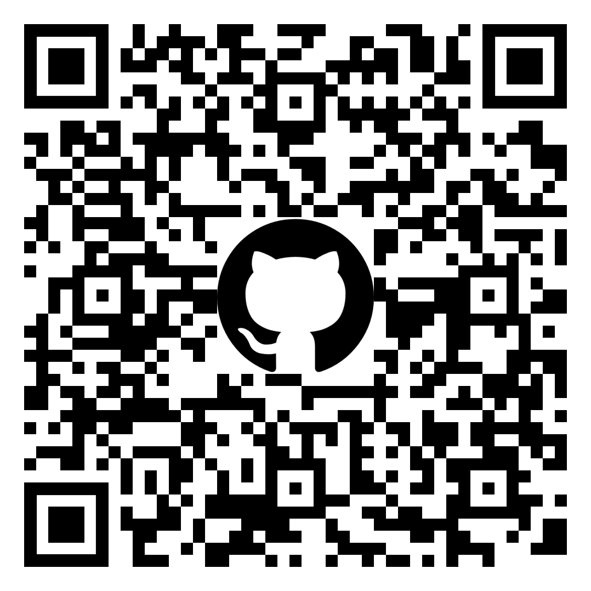

# From Backend to Frontend
### How to Build a TUI Without Losing Your Charm

Hi, I'm Brodie. I'm a software engineer here at Mantel Group & I started learning go a few months ago. I do mostly backend development, building enterprise web APIs using C#.

For those that don't know, Mantel Group is a tech consultancy. We build solutions to problems in data, software, design, and cloud infrastructure domains

==Any questions, please raise hand & ask.==

What got me into using C# was game development. I started off using tools like

---


Scratch: Aimed at teaching kids problem solving skills and logical thinking. It uses bright colours & no-code environment where kids can build using logic blocks & share what they've made.

---


Then Game Maker Studio, which has its own language based around JavaScript, C++, and C#.

---


And finally, Unity Engine: One of the most popular game engines around, leveraging C# to build 2D & 3D games for any platform.

---


When it comes up in conversations that I started programming through game development, a lot of people think it's because as a kid I wanted to play games for the rest of my life. The truth is, I don't play many video games. What really drew me into software through game development was the balance it strikes between the tangibility of the results and the time & effort put towards the programs presentation (think the front end of the app).

Consider building a tic-tac-toe game, both as a CLI (Command line interface) app and a React web app, then we can see some disparity in the presentation of these apps.

---


Assuming you're comfortable with the language they each use, the difficulty of making the logic for the game is the same for both versions. Where the two differ is the tangibility and the effort required to build the presentation side of the program.

React:
- requires more time & effort, especially for a newcomer 
- can be proud of it
- easily deployed
- ready to show your friends & put on your portfolio

CLI:
- on input: clears entire screen & writes new string
- nothing wrong, but far from perfect
- little interactivity
	- choosing cell is done by entering the cell number
- seen in tutorials: approachable & quick to make
- not ready for deployment, friends, or portfolio

This is the contrast I want to highlight. Game development offers a striking balance between the two. You get an interactive, colourful game with minimal time spent on debugging & fine-tuning the program presentation. At the same time, it provides an environment that eases the programming.

Luckily for me, when I started learning Go I discovered what I consider to be a solution to this balance. A way to have visuals without having to build a traditional  frontend for each project, or bear the shame of having an overly simplistic CLI that prints a string. Its name was Charm...

---


Kind of...
Charm, or Charm Bracelet, is a company centred around creating open source dev tools for making awesome TUIs. All of which are written in Go thus far.

If you're asking yourself "what is a TUI" then fear not. I'll go over it and you'll see examples shortly.

---
## Terminal
## User
## Interface


- TUI stands for Terminal User Interface
- UI that combines elements of CLIs and GUIs
- more visually structured environment than a CLI
- windows, panels, and menus
- text-based
- less resource-intensive & time consuming as a developer than a GUI
- primarily keyboard-driven: keeping some CLI efficiency
- good for limited resources & streamlined UX

Here are a few TUIs that I've worked on in Go using the Charm packages:

---


This is an example of a board game called Mancala that I played as a kid. I made this within a few days of finding the Charm libraries. For years I have been creating this game in every language I learned as a kind of benchmark, and building this version provided the best result visually for the least amount of effort.

---


Then there's nap, an open source project I have been helping to build that was started by one of the creators of the Charm libraries. It's a simple TUI that lets you organise text snippets and includes a CLI for scaffolding new projects using these snippets.

---


- Tetrigo: clone of the classic Tetris game
- made during GopherCon a few weeks ago
- I'll do a demo of this at the end of the talk
- feel free to play it during the break
- the reason I like this project is because I was able to build most of it in the 3 days of the conference
	- testament to the Charm packages
	- I found the balance I was after

---


You're going to hear me say Bubble Tea, Bubbles, and Lipgloss a fair bit in this talk, and it's important for you to know what I'm talking about. These are 3 Go packages that each play a role in making TUIs.

Bubble Tea is the most important of the three. It is a framework based on the Elm architecture which we touch on in a second. It gives us a well thought-out structure for building TUIs in Go.

In Bubble Tea it's really easy to make visual components that can be easily reused in different projects. Things like a stopwatch, table, loading bar, list of items are all quite common and easily adapted for different programs. Bubbles is the official package of these components, made by Charm.

Lipgloss is an add-on to Bubble Tea, that gives us an easy way to do styling for our apps. Things like colour, border, padding, text alignment can all be done using Lipgloss.

In this talk I'll discuss how Bubble Tea works behind the scenes, and walk you through making your own little project. 
- Don't worry about following along
	- QR code with all code & slides at the end.

Before diving into the code used for these apps, we need to make sure we understand the logical flow.

Bubble Tea follows a pattern known as the Elm architecture, or TEA (hence the name Bubble Tea). This is similar to MVC (the model-view-controller pattern) for anyone that knows what that is, and I'm happy to discuss the differences after this talk if you're interested. Elm is a language that deserves a talk of its own, so we won't go further into what it is now. What's important to us is an understanding of what defines TEA.

---
# Unidirectional Data Flow


There are 3 components to every Bubble Tea TUI:
- **Model**: In go this is a struct we define to contain all the data (or state) for the application. This is anything and everything we need for the application to run.
- **View**: This is a method that takes the data in the model, and creates a string, which is what the user is shown.
- **Update**: This is a method that is called whenever there is an input operation. This operation could be pressing a key on the keyboard, resizing the terminal window, etc. Update identifies what operation was done, and performs some corresponding logic.

Data flow in TEA is unidirectional, meaning it defines only one way that data can be processed.

1. The user provides input (like a keyboard key press), this is given to the Update method as a Message
2. Update performs the corresponding business logic, altering the model as needed
3. When Update returns, the View method is called to redraw the UI using all the data from the updated Model

This is done every time a Message (such as user input) is received, until the app stops. There is no need for other interactions.

---
# State Management

TEA also restricts us to only dealing with a single model. In other patterns you can have as many models as needed, each used for a different aspect of the business domain. This overcomplicates things for the use case of building TUIs.

I know these concepts can be difficult to grasp just from me talking, so let's build something.

---
	 **let's GO shopping!**


We are going to use this shopping list TUI to better understand TEA (the Elm architecture) and learn to use Bubble Tea, Bubbles, and Lipgloss.

---
```go
func main() {
	m := NewModel()
	p := tea.NewProgram(m)
	if _, err := p.Run(); err != nil {
		fmt.Printf("Alas, there's been an error: %v", err)
		os.Exit(1)
	}
}
```

To start a Bubble Tea program we create a new program using our default model, and then run the program.

---
```go
package tea

type Model interface {
	Init() Cmd

	Update(Msg) (Model, Cmd)

	View() string
}

type Cmd func() Msg

type Msg interface{}
```

Bubble Tea defines an interface for our model to implement:

- Init is the first method that will be called, and it allows us to perform any initial Commands. We will learn more about Commands later, but for now we can just return nil to perform no initial setup.

- Update is called when a Message is received, such as keyboard input. It takes a Message parameter, figures out what type of Message it is, and returns the updated model and a Command.
As an example, we could get a Message that is of type keyboard input and contains the letter Q. We decide that whenever we get the letter Q, we want to quit, so we return model untouched, as well as a Command to quit the program.

- View renders the program UI, which is just a string. After each call of update, view is called to construct a string using the model. This string *is* the TUI output.

Command is one of the return values of the Update method. The documentation defines a Command as a function returning a Message, and defines a Message as a wrapper for any type.

---
```go
type model struct {
	items     []string
	cursor    int
	completed map[int]struct{}
}
```

This is the model we will be using to make the shopping list. Remember the model stores all the data for the app. Our model includes:
- a slice of items in the shopping list
- a cursor, which is the index for which of the items is in focus
- and a map to keep track of which items have been completed.

---
```go
func NewModel() model {
	return model{
		items: []string{
			"Headphones",
			"Lipgloss",
			"Bubble tea",
			"Gopher toy",
		},
		completed: make(map[int]struct{}),
	}
}
```

This is a simple function to return the initial model, which contains some sample data in the list of items, and initialises the map of completed items. We don't set the cursor, so it will default to zero for the first item.

---
```go
func (m model) Init() tea.Cmd {
	return nil
}
```

The easiest is init, where we just return nil to say no operations yet thanks.

---
```go
func (m model) View() string {
	output := "What should we buy at the market?\n\n"

	for i, choice := range m.items {

		cursor := " "
		if m.cursor == i {
			cursor = ">"
		}

		checked := " "
		if _, ok := m.completed[i]; ok {
			checked = "x"
		}

		output += fmt.Sprintf("%s [%s] %s\n", cursor, checked, choice)
	}
	
	output += "\nPress q to quit.\n"
	return output
}
```

In view, we are building a string `output` to show the user. We add a question as a kind of header, then iterate over each item in the shopping list.

If the items index matches the cursor value, then we put an arrow next to the item to show it is selected.

If the items index exists in the map of completed items, then we can use an "X" to show that the item has been bought.

Finally we construct the line from each of these values, and add it to the `output` string.

We also add a Message to the end so the user knows that they can press "Q" to quit.

*Any questions?*

---
```go
func (m model) Update(msg tea.Msg) (tea.Model, tea.Cmd) {
	switch msg := msg.(type) {
	case tea.KeyMsg:
		switch msg.String() {
		case "ctrl+c", "q":
			return m, tea.Quit
		case "up":
			if m.cursor > 0 {  m.cursor--  }
		case "down":
			if m.cursor < len(m.items)-1 {  m.cursor++  }
		case "enter":
			if _, ok := m.completed[m.cursor]; ok {
				delete(m.completed, m.cursor)
			} else {
				m.completed[m.cursor] = struct{}{}
			}			
		}
	}
	return m, nil
}
```

The update method is the most complex since it is the entry point for all of the programs logic. Please stop me if you have any questions at all.

Recall that we take in a Message, return an updated model, and optionally a Command which does some extra work.

Here we are using a type switch to check if the Message is keyboard input. If it is, we get the Messages' string, which we can use to determine which key was pressed.

If it was control-C or the "Q" key, then we return the model `m` untouched, as well as a quit Command. This is a special built-in Command that bubble tea knows how to handle on its own.

If the key was up or down, we would increment or decrement the cursor, and if it was enter then we would toggle whether the item was completed or not.

*Any questions?*

---
# Checkpoint


This is what we end up with for that hard work. It does the job but it could be prettier. We could also leverage pre-made components which makes things easier as the app grows. We'll get to both of these soon, but first I want to take some time to explore Commands.

---
```go
func (m model) saveToFile() tea.Msg {
	list := ""
	for _, item := range m.items {
		list += item + "\n"
	}

	err := os.WriteFile("shopping-list.txt", []byte(list), 0644)
	return savedMsg{err}
}

type savedMsg struct {
	err error
}
```

This method saves our shopping list to a file. This is a Command, because it's a function returning a Message. The Message in this case is a custom struct holding the error value that may occur when saving the file.

This is a very simple example of an operation that *could* require a lot of time, and would result in changes to the Model.

---
```go
func (m model) Update(msg tea.Msg) (tea.Model, tea.Cmd) {
	switch msg := msg.(type) {
	case tea.KeyMsg:
		switch msg.String() {
		...
		// The "s" key saves the list to a file
		case "s":
			return m, m.saveToFile
		}
	// Is it a Message we're sending to ourselves to save the list?
	case savedMsg:
		if msg.err != nil {
			fmt.Printf("Alas, there's been an error: %v\n", msg.err)
			return m, tea.Quit
		}
	}
	return m, nil
}
```

Let's take a walk through the flow of saving a file.

The user presses "s". This is sent as a key Message to the Update method. This returns the unchanged model, as well as the `saveToFile` method, which is our custom Command.

Bubble Tea will ensure that this Command is run. The Command returns our custom `savedMsg` type. Bubble Tea calls the Update function again giving us the `savedMsg` which we can process the same as any other Command. In this case we handle any errors that occurred, and then continue with normal execution.

As a summary, Commands give us the ability to perform operations within separate functions, keeping a separation of concerns and decluttering the Update method. 

We won't see it in this example, but sometimes we may want to have nested models. This allows us to have reusable components and apps with multiple pages. Commands are a way to send signals and data up this hierarchy of models. Recently I built a Tetris clone with a menu; the menu held the game and the leaderboard models, and when the game was done it would send a Command to the menu containing the players score, which would be given to the leaderboard model.

---
# Checkpoint


The next thing I want to address is the help Message at the bottom. It tells the user how to quit, but not how to interact with the app. What about when there are lots more controls? What about if the app has different controls at different times?

---


For this we can make use of Bubbles, an official library of Bubble Tea components. Here you can see components for tables, file pickers, text input, stopwatch, etc.

---


We will be using two components to make our app better. The first is this component which adds an interactive help area to our app. This will let us display a short help Message, and if the user needs to they can press the question mark key to get a more detailed help Message.

The second is a key-map. This has no visual element, but will make it easier to manage the keys for different operations, change key-maps depending on the application state, and even allow users to define custom keys if you wanted to.

To create a key-map we define ...

---
```go
type KeyMap struct {
	Quit   key.Binding
	Up     key.Binding
	Down   key.Binding
	Submit key.Binding
	Save   key.Binding
	Help   key.Binding
}
```

a type containing a key binding for each operation we want the app to perform, ...

---
```go
func NewKeyMap() KeyMap {
	return KeyMap{
		Quit:	key.NewBinding(
			key.WithKeys("q", "ctrl+c"), 
			key.WithHelp("q", "quit")),
		Up:		key.NewBinding(
			key.WithKeys("up"), 
			key.WithHelp("up arrow", "up")),
		...
	}
}
```

and a function or global variable defining the default values for this type. I've only shown how to do this for two operations, because they all have the same syntax and they don't fit nicely on the screen. To define each of the key bindings we need to specify the keys we want to associate with the operation, as well as some text that is shown in the help Message.

---
...
```go
type model struct {
	...
	keys     KeyMap
	help     help.Model
}

func NewModel() model {
	return model{
		...
		keys: NewKeyMap(),
		help: help.New(),
	}
}
```

Once we have imported the Bubbles package, we can just add our key-map type to the model. We'll also add the help Model (from the Bubbles package) to our own Model like so, and use its helper function to create a new default Model. We'll finish off the help stuff soon.

---
### Before
```go
func (m model) Update(msg tea.Msg) (tea.Model, tea.Cmd) {
	switch msg := msg.(type) {
	case tea.KeyMsg:
		switch msg.String() {
		case "ctrl+c", "q":
			return m, tea.Quit
		...
		}
	...
	}

	return m, nil
}
```

### After
```go
func (m model) Update(msg tea.Msg) (tea.Model, tea.Cmd) {
	switch msg := msg.(type) {
	case tea.KeyMsg:
		switch {
		case key.Matches(msg, m.keys.Quit):
			return m, tea.Quit
		...
		}
	...
	}

	return m, nil
}
```

On the left is how we *were* handling key presses, and on the right you can see how we use our new key-map to do this. Instead of switching on the Messages' string, we use a switch without an expression and take advantage of the `key.Matches` helper method, giving it the Message and key binding. It returns true if it matches any of the keys we defined for the key binding.

And that's it for key bindings. To display a help Message with these bindings is a little more work, but not a lot. Recall that we already used the `help.New` function to create a default Model within our Model.
---
```go
func (m model) Update(msg tea.Msg) (tea.Model, tea.Cmd) {
	switch msg := msg.(type) {
	case tea.KeyMsg:
		switch {
		...
		case key.Matches(msg, m.keys.Help):
			m.help.ShowAll = !m.help.ShowAll
		}
	...
	}

	return m, nil
}
```

We want the user to be able to use the question mark key to switch between the short help Message, and the long one. This can be done by receiving a key Message like we did previously, and the operation is just toggling a boolean stored within the help Model.
---
### Before
```go
func (m model) View() string {
	...
	output += "\nPress q to quit.\n"
	return output
}
```
### After
```go
func (m model) View() string {
	...
	output += "\n" + m.help.View(m.keys)
	return output
}
```

To view the help Message, we can replace the hardcoded string with a call to the help Models View method. This shows how easy it is to embed Models within each other as I mentioned earlier.

We have a problem at this point. When we defined the key-map `keys`, we didn't follow any specification. This View method expects the key-map to meet an interface.
---
```go
type KeyMap interface {

	ShortHelp() []key.Binding

	FullHelp() [][]key.Binding
}
```

Short and full help do exactly as they sound. Each returns some key bindings to display to the user, depending on the value of the `showAll` boolean.
---
```go
func (k KeyMap) ShortHelp() []key.Binding {
	return []key.Binding{k.Quit, k.Help}
}

func (k KeyMap) FullHelp() [][]key.Binding {
	return [][]key.Binding{
		{k.Up, k.Down, k.Submit},
		{k.Save, k.Help, k.Quit},
	}
}
```

Here we add these methods to our key-map type. `ShortHelp` will be displayed by default, and only tells the user how to quit the program or get help. Performing the help action will switch the `ShowAll` boolean to true and the user will be presented with the `FullHelp` which you can see contains all the program keys.
---
# Checkpoint


TADA! We have an interactive help Message at the bottom of the application. And most importantly, we didn't have to make it ourselves. It's not that the help or key-map would have been hard to make, but making these kinds of features into reusable components makes your programs more consistent. It also allows you to focus more on the business logic, which was my motive for using TUIs in the first place.

Bubbles is the *official* component library, but that shouldn't stop you from creating your own components as needed. You can see other repos of user-made BubbleTea components linked on the Bubbles readme.
---


The final thing I want to show you is how to add some style to these TUIs. Lipgloss is a package that enables us to add these aesthetics, which in some cases are not a concern, but can make the user experience much nicer.
---
```go
var focussedStyle = lipgloss.NewStyle().Foreground(lipgloss.Color("#AFBEE1"))

var unfocussedStyle = lipgloss.NewStyle().Foreground(lipgloss.Color("241"))

var completedStyle = lipgloss.NewStyle().Foreground(lipgloss.Color("#15DA84"))

var appStyle = lipgloss.NewStyle().Border(lipgloss.RoundedBorder(), true).Padding(1, 1, 0)
```

I'm going to create four global variables each storing a new style. The first three just set a custom foreground colour (this is the text colour). One and three use a hex value to do this, and two uses an ANSI colour code. There is a lot of flexibility built into these functions.

The fourth style (at the bottom) is for the whole app. It adds a border with rounded corners, and defines the padding. The padding is a variadic function, which in this case takes one to four integers, similar to defining padding in CSS. In This case we are setting the top and horizontal sides to one, and the bottom to zero.
---
```go
 1. func (m model) View() string {
 2. 	output := "What should we buy at the market?\n\n"
 3. 
 4. 	for i, choice := range m.choices {
 5. 		cursor := " "
 6. 		if m.cursor == i {
 7. 			cursor = ">"
 8. 			choice = focussedStyle.Render(choice)
 9. 		} else {
10. 			choice = unfocussedStyle.Render(choice)
11. 		}
12. 
13. 		checked := " "
14. 		if _, ok := m.selected[i]; ok {
15. 			checked = completedStyle.Render("x")
16. 		}
17. 
18. 		output += fmt.Sprintf("%s [%s] %s\n", cursor, checked, choice)
19. 	}
20. 
21. 	output = appStyle.Render(output)
22. 	output += "\n" + m.help.View(m.keys)
23. 	return output
24. }
```

Since these are global variables we can use them anywhere in the package.

On lines 8 and 10 we are modifying the `choice` string to either be rendered using the focussed or unfocussed style. The choice string is the name of the item in the list. This will help users determine which item is currently selected, because the current item is blue, and the others are a fainter colour.

On line 15 we are using the completed style to make the "x" character green.

And finally on line 21 the `output` string is rendered. `output` contains everything except the help Message, and our style adds the rounded border and padding we saw earlier.
---


Finally: the app we have been waiting for! Now you can take your laptop with you to shops and use your terminal as a shopping list like you've always wanted... or maybe that's just me.

In all seriousness, this was a *very* simple example, but hopefully these tools will inspire you to build some really cool programs, or enable you to add a better presentation to your current project.

Let's wrap-up by taking a look at some TUIs that are more complex than our shopping list.

---


Lazygit: Started before Charm was around, but a great use case for a TUI & my daily driver for git

---


Tetrigo

---





